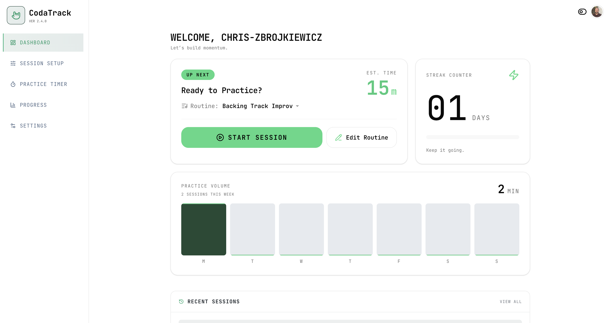
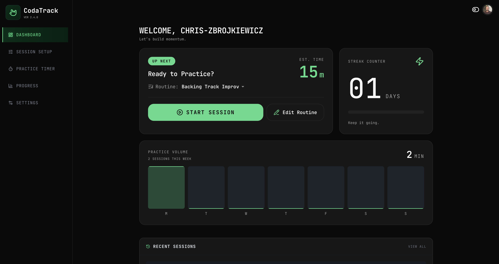

# CodaTrack

CodaTrack is a guitar practice tracker focused on building consistency through fast session logging and clear progress visibility. The V1 prioritizes minimal friction (timer + optional note), weekly summaries, and streak tracking.

| Light Mode                             | Dark Mode                            |
| -------------------------------------- | ------------------------------------ |
|  |  |

## Live Demo

[https://coda-track.vercel.app/](https://coda-track.vercel.app/)

## Status

## Status

- Work in progress (V1) — core flows (auth, session tracking, backend persistence) are implemented. UI and additional features are under active development.

## Highlights

- Full-stack Next.js app with server-side API routes
- GitHub OAuth authentication via Auth.js
- Postgres (Supabase) integration with serverless backend
- Health check endpoint + GitHub Actions heartbeat to prevent Supabase inactivity pause
- Designed for fast, low-friction session tracking UX

## V1 Features

- Authentication (required for app usage)
- Practice session logging (timer + optional note)
- Weekly summary (total time, session count, practiced days)
- Streak tracking
- Dashboard + Progress screens (core insights)

## Tech Stack

- Next.js (App Router)
- Postgres (Supabase as DB host only)
- Backend API via Next.js Route Handlers
- Auth via Auth.js (NextAuth)
- UI based on custom design

## Documentation

Planning and scope are documented in `/docs`:

- `01-feature-brief.md` — product scope and success criteria
- `02-user-flow.md` — user journeys for V1
- `03-data-model.md` — entities and derived metrics
- `04-architecture.md` — system architecture and boundaries
- `05-api-contract.md` — API endpoints and payload shapes
- `06-screen-map.md` — screens mapped to data + endpoints

## Local Setup

```bash
npm install
npm run dev
```

Required environment variables:

- AUTH_SECRET
- NEXT_PUBLIC_SUPABASE_URL
- NEXT_PUBLIC_SUPABASE_ANON_KEY
- DATABASE_URL

(Optional for GitHub auth)

- AUTH_GITHUB_ID
- AUTH_GITHUB_SECRET

## Demo uptime / Supabase pause prevention

Supabase Free projects can pause after about 7 days of inactivity. This repo includes a lightweight GitHub Actions heartbeat to keep the demo reachable by periodically pinging a health check route.

- Workflow file: `.github/workflows/heartbeat.yml`
- Triggers:
  - Scheduled cron: 3 times/week (`0 13 * * 1,3,5`, UTC)
  - Manual trigger: `workflow_dispatch`
- Default target pattern: `GET /api/health/db` on your deployed app (for example, `https://your-app.example.com/api/health/db`)

The route should be lightweight and confirm basic app + database availability.  
Runs a few times per week—enough to prevent inactivity without generating unnecessary traffic.

### Configure target URL

Set a repository secret named `HEARTBEAT_URL` in GitHub:

1. Go to GitHub repository **Settings → Secrets and variables → Actions**
2. Create **New repository secret**
3. Name: `HEARTBEAT_URL`
4. Value: full public URL to your health route (recommended: `https://<your-domain>/api/health/db`)

The URL must be publicly reachable from GitHub-hosted runners.  
The job retries up to 3 times and fails if the HTTP status is not 2xx, making issues visible in GitHub Actions.

### Run heartbeat manually

1. Open GitHub repository **Actions**
2. Select **Demo Heartbeat**
3. Click **Run workflow**

## License

TBD

## Configuration

This project uses environment variables for authentication and database access.

Sensitive values (OAuth credentials, database URLs) are managed via the hosting
provider and are not committed to the repository.
